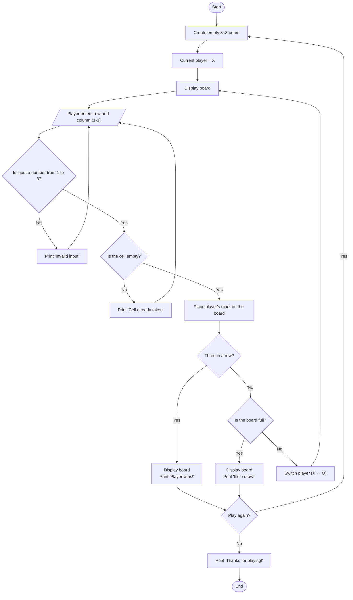

# Tic-Tac-Toe Pseudocode

## General Ideas

- Tic-tac-toe is a two-player game played on a 3×3 grid.
- The board is stored as a 3×3 list of lists (rows and columns). Each cell holds `" "` (empty), `"X"`, or `"O"`.
- Players pick a cell by entering its **row** and **column**, each from 1 to 3.
- The program goes round in a loop: show the board, ask for a move, check the move is allowed, place the mark, check for a win or a draw, then switch players.
- The program should be split into small functions: create the board, display it, get a move, check for a winner, check for a draw, and switch players.

## General Rules

1. Player **X** always goes first. After that, players take turns.
2. On each turn, a player places their mark in one **empty** cell.
3. A player can't pick a cell that is already taken or outside the board.
4. The first player to get **three marks in a row** wins. The row can be horizontal, vertical, or diagonal.
5. If all 9 cells are filled and nobody has won, the game is a **draw**.
6. When a game ends, the players can choose to play again.

## Game Logic

```
CONSTANTS
    EMPTY    = " "
    PLAYER_X = "X"
    PLAYER_O = "O"
    SIZE     = 3

FUNCTION create_board()
    board = empty list
    FOR row FROM 1 TO SIZE
        ADD [EMPTY, EMPTY, EMPTY] TO board
    RETURN board

FUNCTION display_board(board)
    FOR row FROM 0 TO SIZE - 1
        PRINT " " + board[row][0] + " | " + board[row][1] + " | " + board[row][2]
        IF row < SIZE - 1 THEN
            PRINT "-----------"

FUNCTION get_move(board, player)
    LOOP
        PRINT player + ", enter row (1-3): "
        READ row
        PRINT player + ", enter column (1-3): "
        READ col

        IF row or col is not a number between 1 and 3 THEN
            PRINT "Invalid input. Try again."
            CONTINUE

        IF board[row - 1][col - 1] != EMPTY THEN
            PRINT "Cell already taken. Try again."
            CONTINUE

        RETURN (row - 1, col - 1)          // convert to 0-based indexes

FUNCTION check_winner(board)
    // rows
    FOR r FROM 0 TO 2
        IF board[r][0] != EMPTY AND board[r][0] == board[r][1] == board[r][2] THEN
            RETURN board[r][0]

    // columns
    FOR c FROM 0 TO 2
        IF board[0][c] != EMPTY AND board[0][c] == board[1][c] == board[2][c] THEN
            RETURN board[0][c]

    // diagonals
    IF board[1][1] != EMPTY THEN
        IF board[0][0] == board[1][1] == board[2][2] THEN RETURN board[1][1]
        IF board[0][2] == board[1][1] == board[2][0] THEN RETURN board[1][1]

    RETURN NONE

FUNCTION is_board_full(board)
    FOR EACH row IN board
        FOR EACH cell IN row
            IF cell == EMPTY THEN RETURN FALSE
    RETURN TRUE

FUNCTION switch_player(player)
    IF player == PLAYER_X THEN RETURN PLAYER_O
    ELSE RETURN PLAYER_X

FUNCTION play_game()
    board = create_board()
    current_player = PLAYER_X

    LOOP
        display_board(board)
        (row, col) = get_move(board, current_player)
        board[row][col] = current_player

        winner = check_winner(board)
        IF winner != NONE THEN
            display_board(board)
            PRINT winner + " wins!"
            BREAK

        IF is_board_full(board) THEN
            display_board(board)
            PRINT "It's a draw!"
            BREAK

        current_player = switch_player(current_player)

MAIN
    LOOP
        play_game()
        PRINT "Play again? (y/n): "
        READ answer
        IF answer != "y" THEN BREAK
    PRINT "Thanks for playing!"
```

## Example Board

Example board coordinates (row, column):

```
(1,1) | (1,2) | (1,3)
---------------------
(2,1) | (2,2) | (2,3)
---------------------
(3,1) | (3,2) | (3,3)
```

Example displayed board:

```
   |   |
-----------
   | O |
-----------
 X | O | X
```

This board would be stored as:

```
board = [
    [" ", " ", " "],
    [" ", "O", " "],
    ["X", "O", "X"]
]
```

In this example, it's **O**'s turn. If O picks `(1,2)`, column 2 becomes O, O, O and **O wins**.

## Flowchart


